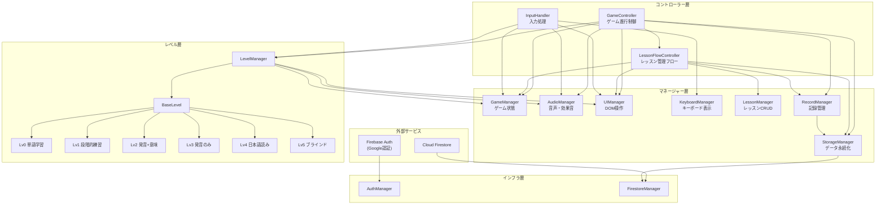
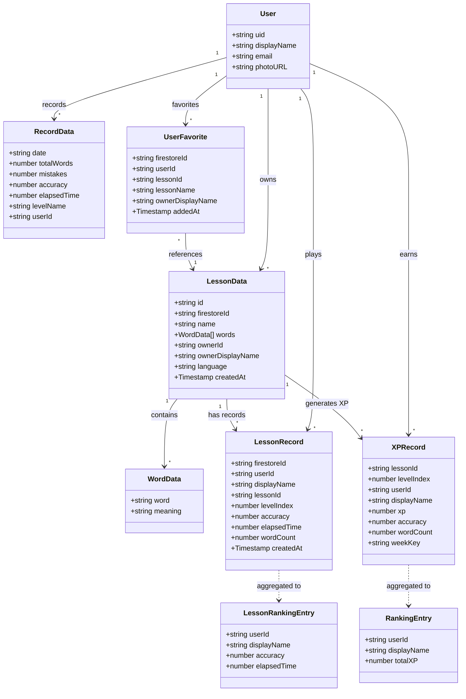
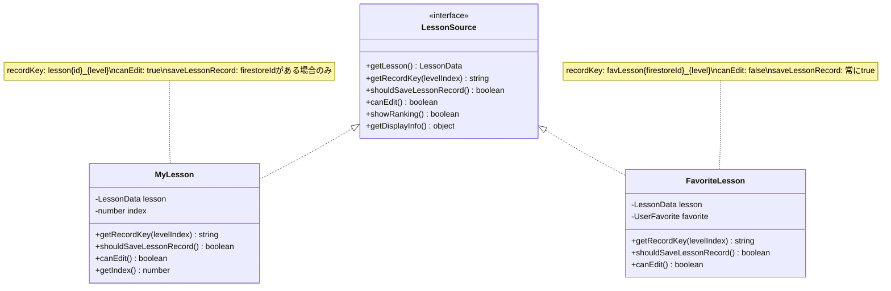
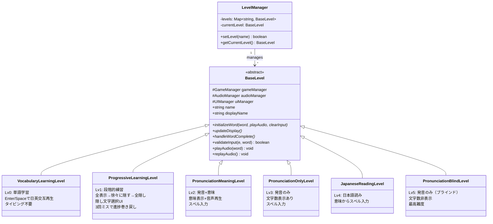
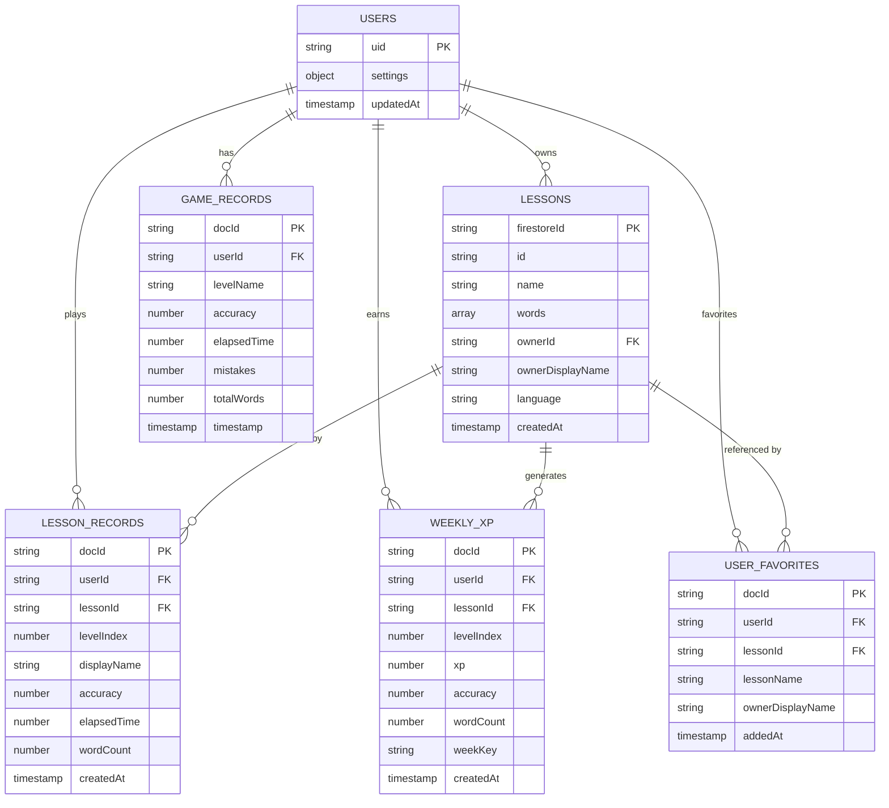
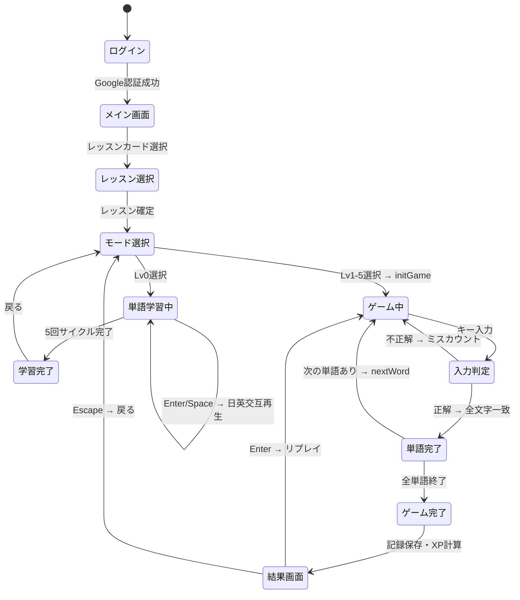
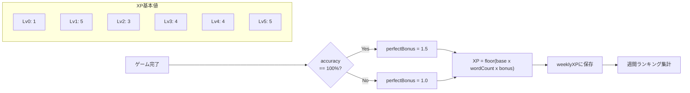

# タイピングマスター

キータイピング練習アプリケーション。TypeScript + Vite で構築し、Firebase（Auth + Firestore）でデータ永続化を行う SPA。

## 機能

### 学習モード（6種類）

| レベル | モード | 内容 |
|--------|--------|------|
| Lv0 | 単語学習 | 発音聞き流し（Enter/Spaceで日英交互再生） |
| Lv1 | 段階的練習 | 全表示→徐々に隠す→全隠し（隠し文字選択UI付き） |
| Lv2 | 発音+意味 | 発音と意味を表示してスペル入力 |
| Lv3 | 発音のみ | 発音のみでスペル入力（文字数表示あり） |
| Lv4 | 日本語読み | 日本語の意味からスペル入力 |
| Lv5 | 発音のみ（ブラインド） | 発音のみでスペル入力（文字数非表示） |

### その他の機能

- カスタムレッスンの作成・編集・削除
- 多言語対応（英語 / マレー語）
- スペース・アポストロフィの入力省略
- リアルタイムキーボードビジュアライゼーション
- コンボシステム・XPランキング
- お気に入りレッスン・レッスン別ランキング
- ゲームクリア演出（紙吹雪・効果音・称賛メッセージ）

## セットアップ

```bash
npm install
cp .env.template .env  # Firebase環境変数を設定
npm run dev             # 開発サーバー起動（ポート3000）
```

## コマンド

| コマンド | 説明 |
|---------|------|
| `npm run dev` | 開発サーバー起動（Vite） |
| `npm run build` | プロダクションビルド（`dist/`） |
| `npm run preview` | ビルドプレビュー |
| `npm run typecheck` | TypeScript型チェック |
| `npm run deploy` | Firebase Hostingにデプロイ |

## アーキテクチャ

### ファイル構成

```
index.html              # メインHTML
src/
  main.ts               # エントリーポイント
  types.ts              # TypeScript型定義
  firebase.ts           # Firebase初期化
  auth.ts               # AuthManager（Google認証）
  firestore.ts          # FirestoreManager（CRUD操作）
  InputHandler.ts       # 入力処理
  windowProxies.ts      # レガシー互換プロキシ
  styles.css            # スタイルシート
  controllers/
    GameController.ts   # ゲーム進行制御
    LessonFlowController.ts # レッスン管理フロー
  managers/
    AudioManager.ts     # 音声機能（タイピング音、発音、効果音）
    GameManager.ts      # ゲーム状態・ロジック管理
    KeyboardManager.ts  # キーボード表示・ハイライト
    LessonManager.ts    # レッスンCRUD・単語解析
    RecordManager.ts    # 記録管理・表示
    StorageManager.ts   # データ永続化（Firestore連携）
    UIManager.ts        # DOM操作・UI状態管理
  levels/
    BaseLevel.ts        # レベル基底クラス（abstract）
    level-manager.ts    # LevelManager（多態性によるレベル切替）
    level0-vocabulary.ts       # Lv0: 単語学習
    level1-progressive.ts      # Lv1: 段階的練習
    level2-pronunciation-meaning.ts  # Lv2: 発音+意味
    level3-pronunciation-only.ts     # Lv3: 発音のみ
    level4-japanese-reading.ts       # Lv4: 日本語読み
    level5-pronunciation-blind.ts    # Lv5: 発音のみ（ブラインド）
```

### コンポーネント依存関係



## ドメインモデル

### エンティティ関連図



### レッスンソース（Strategy パターン）



### レベル階層（Template Method パターン）



### Firestore コレクション構成



### ゲームフロー状態遷移



### XP 計算フロー



## 技術スタック

- **TypeScript** (ES2020)
- **Vite** (ビルドツール)
- **Firebase** (Auth + Firestore + Hosting)
- **Web Audio API / Web Speech API**
